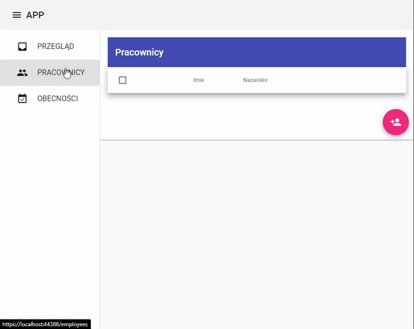
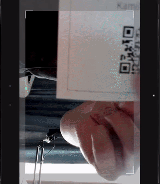
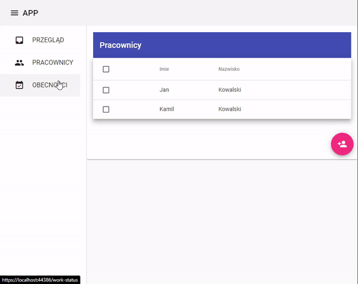

# Employee Work Tracker &middot; [](https://github.com/stawu/employee-work-tracker/blob/master/LICENSE)

Prototype of system that can monitor work time of employees. 
Job entrance and exit requires to scan employee's qr badge, which can be downloaded from admin panel. 
Android app (qr scanner) sends scans as work time events to backend server. 
Backend server is using these events to calculate work time.

## Installing / Getting started

This project at the current state is only prototype, it lacks of many features and should be used only in test purposes.

Getting .NET server to run in docker.

```shell
docker build -t employee-work-tracker https://github.com/stawu/employee-work-tracker.git
docker run --rm -p 5000:5000 -it employee-work-tracker
```

Admin panel is available at: 
```http
http://localhost:5000
```

---

### Add employee and print qr badge


### Start (8:22) and end (14:22) of job


### Job overview


---

## Developing

## Licensing

licensed under the

GNU General Public License v3.0